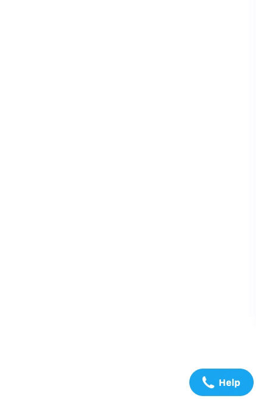

# Web Widget Channel Injector

This script was developed to allow Zendesk admins to add new custom items under the Zendesk Web Widget once Answer Bot presents the list of available channels.

## HOW DOES THIS WORK?

This script combines observers and an "event bus" that makes it possible to create a communication between the parent page and the Web Widget iframe. This way, you can benefit from DOM manipulation to add extra channel options as soon as Answer Bot presents the list of Zendesk standard channels.

## REQUIREMENTS

You need to have at least **two** standard channels active to make the script activate. You can enable channels at `https://{{subdomain}}.zendesk.com/agent/admin/widget`.

## GETTING STARTED

- Install the Zendesk Web Widget on your web site (`https://{{subdomain}}.zendesk.com/agent/admin/widget`) or your Zendesk Help Center.
- Install the `script.js` file on your web site or copy its content to your main JS file.
- Set the `widgetNewChannels` object accordingly to what you want to achieve.

## HOW TO CONFIGURE IT

You need to edit the `widgetNewChannels` object in your script accordingly to your use case. You can find the expected properties and usage examples below.

### widgetNewChannels

This is the main configuration object, where you can change the script settings depending on your use case.

| Key   | Type    | Description                                                                                                 |
| ----- | ------- | ----------------------------------------------------------------------------------------------------------- |
| items | Array   | List of objects containing your new custom channels.                                                        |
| debug | Boolean | You can set this to `true` if you want to see when the script is being triggered on your developer console. |

### widgetNewChannels.items

This array can store as many objects as you want. Those objects will be your new channels.

| Key             | Type     | Description                                                                                                                                                                                                                           |
| --------------- | -------- | ------------------------------------------------------------------------------------------------------------------------------------------------------------------------------------------------------------------------------------- |
| icon (optional) | String   | You can define any string as your icon, but adding an icon is recommended (you can find some on [Emojipedia](https://emojipedia.org/)).                                                                                               |
| text            | Object   | This is where you set the label of your button. You can define different labels for different locales, and a default value **(required)**. Example: `{ 'pt-br': 'Esse é um canal customizado', default: 'This is a custom channel' }` |
| action          | Function | This is where you should create the function to trigger when your new channel is selected.                                                                                                                                            |

## CONFIGURATION EXAMPLES

```js
widgetNewChannels = {
  items: [
    // Multi-channel (open the Sunshine Conversations Widget from the Zendesk Web Widget)
    {
      icon: '💬',
      text: {
        'pt-br': 'Atendimento multicanal',
        de: 'Mehrkanal-Konversation',
        default: 'Multi-channel conversation'
      },
      action: function () {
        const smoochAppId = '5efdb50d677ee2000d73bdfc'
        const smoochIntegrationId = '5efdb5275b4209000c99d0b2'

        // prettier-ignore
        !function(o,p,s,e,c){var i,a,h,u=[],d=[];function t(){var t='You must provide a supported major version.';try{if(!c)throw new Error(t);var e,n='https://cdn.smooch.io/',r='smooch';if((e='string'==typeof this.response?JSON.parse(this.response):this.response).url){var o=p.getElementsByTagName('script')[0],s=p.createElement('script');s.async=!0;var i=c.match(/([0-9]+)\.?([0-9]+)?\.?([0-9]+)?/),a=i&&i[1];if(i&&i[3])s.src=n+r+'.'+c+'.min.js';else{if(!(4<=a&&e['v'+a]))throw new Error(t);s.src=e['v'+a]}o.parentNode.insertBefore(s,o)}}catch(e){e.message===t&&console.error(e)}}o[s]={init:function(){i=arguments;var t={then:function(e){return d.push({type:'t',next:e}),t},catch:function(e){return d.push({type:'c',next:e}),t}};return t},on:function(){u.push(arguments)},render:function(){a=arguments},destroy:function(){h=arguments}},o.__onWebMessengerHostReady__=function(e){if(delete o.__onWebMessengerHostReady__,o[s]=e,i)for(var t=e.init.apply(e,i),n=0;n<d.length;n++){var r=d[n];t='t'===r.type?t.then(r.next):t.catch(r.next)}a&&e.render.apply(e,a),h&&e.destroy.apply(e,h);for(n=0;n<u.length;n++)e.on.apply(e,u[n])};var n=new XMLHttpRequest;n.addEventListener('load',t),n.open('GET','https://'+e+'.webloader.smooch.io/',!0),n.responseType='json',n.send()}(window,document,'Smooch',smoochAppId,'5')

        Smooch.init({ integrationId: smoochIntegrationId }).then(function () {
          zE.hide()
          Smooch.open()
        })
      }
    },

    // Custom form (open a specific custom form from within the channels selection list)
    {
      icon: '📄',
      text: {
        'pt-br': 'Formulário customizado',
        de: 'Benutzerdefiniertes Formular',
        default: 'Custom form'
      },
      action: function () {
        // Custom ticket form ID to show
        const customFormId = 360001621980

        zE.hide()

        zE('webWidget', 'updateSettings', {
          webWidget: {
            chat: {
              suppress: true
            },
            helpCenter: {
              suppress: true
            },
            talk: {
              suppress: true
            },
            answerBot: {
              suppress: true
            },
            contactForm: {
              suppress: false
            }
          }
        })

        zE('webWidget', 'updateSettings', {
          contactForm: {
            ticketForms: [{ id: customFormId }]
          }
        })

        zE.activate()
      }
    }
  ],
  debug: true
}
```

## SCREENSHOT DEMO

<kbd></kbd>

## AUTHOR

This script was developed as a proof of concept and it has been maintained by Marcelo De Bortoli (EMEA Senior Solution Developer).

## CHANGELOG

### v0.1 - 2021-03-24

- Initial commit
